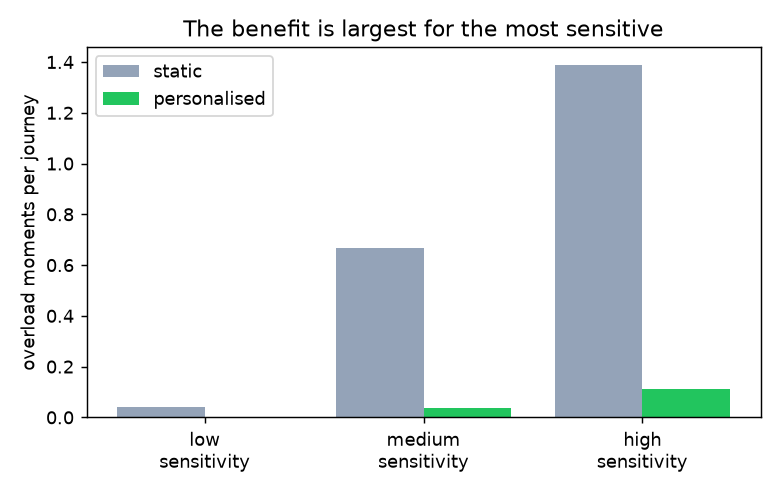
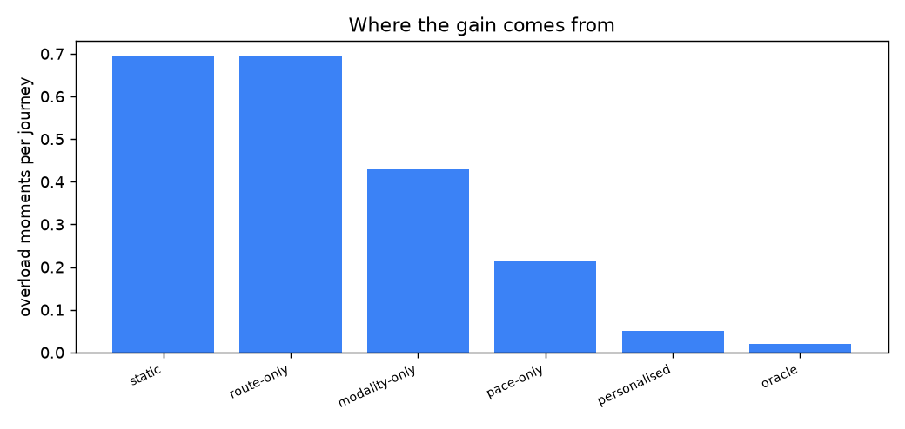

# Cairn

An adaptive guidance system for navigating overstimulating public spaces. It turns a goal,
like reaching a lecture hall, into short, paced steps instead of a dense map, learns how the
individual moves, routes around the loud and crowded stretches, and steps in with grounding
before the person is overwhelmed.

These spaces do not overwhelm people because the people lack ability; they overwhelm because
the environment demands constant filtering, decision-making, and orientation at once. Cairn
reduces that load: one step at a time, timed to the person.

The name: a cairn is a stack of stones that marks a trail one step at a time, often left by
a traveler who came before to help the next person find their way.

> Live demo (runs in your browser): **https://ananyasdrafts.github.io/cairn/** · design in
> [docs/DESIGN.md](docs/DESIGN.md). Simulation-first.

## what it does

Built from scratch, simulation-first. The engine:

- **campus**: the space as a graph; routing minimises distance plus a penalty on sensory
  load, so it can prefer a calmer way.
- **travelers**: simulated people with their own pace, hesitancy, stress sensitivity, and
  preferred step format (text, icon, haptic).
- **guidance**: a route becomes short, paced steps; lighter and slower as stress rises.
- **journey**: walks a traveler through a route, grounding when stress runs high, and scores
  it (time, hesitation, peak stress, overload).
- **personalisation**: a small on-device model reads a short calibration and predicts the
  person's preferred modality and sensitivity, so guidance can fit them.
- **federated learning**: that model is trained across many simulated people with FedAvg,
  weights only, raw behaviour never leaves the device.

## what I found

On held-out simulated travelers, over five seeds:

- **Personalising the guidance roughly removes overload.** Overload moments per journey fall
  from 0.70 (a static one-size policy) to 0.05, against 0.02 for an oracle that knows each
  person's true traits.
- **The benefit is largest for the people who need it most.** Split by sensitivity, the most
  sensitive travelers go from 1.39 overload moments to 0.11; the least sensitive barely change,
  they were managing already.

  

- **Most of the gain is pacing.** An ablation: easing the pace alone reaches 0.21 overload,
  matching the modality alone 0.43, and taking the calmer route alone does little here (0.70);
  together they reach 0.05.

  

- **Federated learning costs almost nothing.** Weights only, data local: modality accuracy
  0.76 and sensitivity error 0.10, against 0.82 and 0.09 for centralised training on pooled
  data.
- **Two things I tried that did not help, reported straight.** Easing ahead of a busy segment
  (anticipation) matched simply reacting to current stress (0.26 vs 0.26), because on these
  short routes the reactive easing is already quick enough. And acting cautiously when the
  model is unsure (confidence-aware) slightly hurt (0.05 to 0.07, and on the low-confidence
  cases 0.08 to 0.11), because the model is accurate enough that caution costs more than it
  saves. Both would matter more with lagged feedback or a weaker model; both are implemented
  and kept off the main path.

## demo

A browser simulator lets you set how sensitive a traveler is and compare static versus
personalised guidance as they walk to the lecture hall: the route (calmer when
personalised), the paced steps one at a time, the stress meter, and grounding when stress
runs high. **Live at https://ananyasdrafts.github.io/cairn/**; see [web/README.md](web/README.md)
to run it locally.

## why it is built in a simulator

Like a flight simulator for the problem: reproducible, no real-user data, and the place to
get the adaptive guidance and the federated personalisation right and measure honestly
whether personalisation reduces hesitation and overload. Real wearables and real spaces come
after.

## run it

```bash
pip install -e ".[dev]"
pytest                      # 21 tests
python scripts/run_eval.py  # the personalisation + federated study, writes the figure
```

## design and scaling

This repo is the simulator: it proves the adaptive guidance and the federated personalisation
with no external data. The full design, including what the real product needs and how it
scales, is in [docs/DESIGN.md](docs/DESIGN.md); the short version:

**The real product (parked).** Beyond the simulator it would use real routing (Google or
Apple Maps APIs) and real phone and wearable signals, and would add the safety layer
(grounding, plus an optional alert to a trusted contact if distress persists). The two hard
pieces are indoor positioning and a sensory-load signal per place, which does not exist as a
dataset. And because this is assistive technology, it needs co-design and testing with
autistic, sensory-sensitive, and anxious people, with IRB and consent. None of that is needed
for the simulation, but the design names all of it.

**MVP and scaling.** The smallest real version is one campus, advancing by user confirmation
plus a few checkpoints, which sidesteps precise indoor positioning. It scales space by space
through universities, employers, and accessibility programs, and two privacy-respecting
network effects build the missing data through use: federated personalisation improves
cold-start as more people contribute weights, and consented passive sensing gradually builds
a sensory-load map of each space.

**Grounded in the literature.** The simulation parameters are set to be directionally
consistent with research, not fit to data: cognitive load theory (short single steps lower
load), wayfinding (people favour fewer-decision routes), sensory-processing work (busy
environments exacerbate overload), slow-breathing evidence (grounding lowers arousal), and
federated averaging (McMahan et al., 2017). Citations in [docs/DESIGN.md](docs/DESIGN.md).

Assistive AI should not replace someone's independence; it should protect it, by giving
information in a form their nervous system can actually use.

## license

MIT
